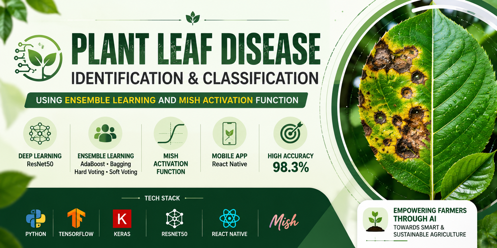
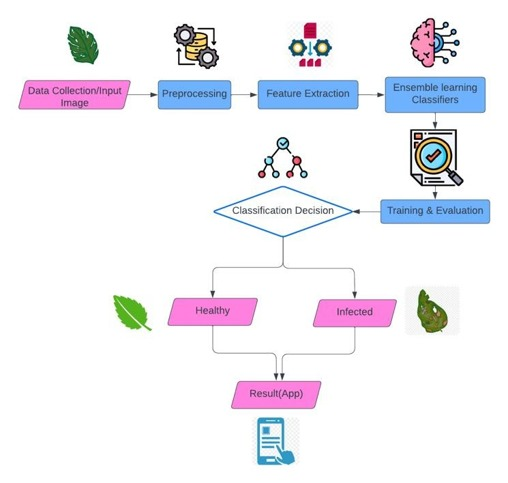
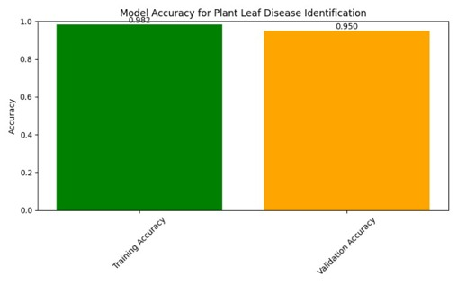
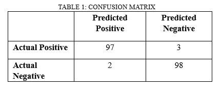
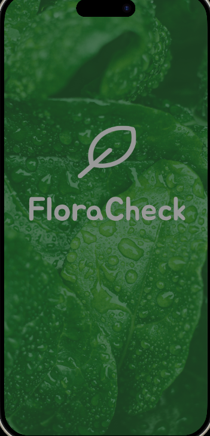
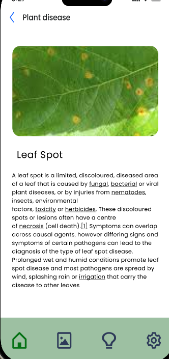
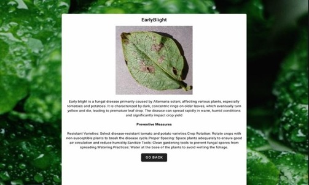

<div align="center">



# 🌿 Plant Leaf Disease Identification & Classification

### Using Ensemble Learning and Mish as an Activation Function

<p>
An IEEE Published Deep Learning Research Project for Accurate Plant Disease Detection
</p>

<p>


</p>

<p>
<a href="https://ieeexplore.ieee.org/document/11031481">📄 IEEE Paper</a> •
<a href="https://www.figma.com/proto/giq8AFMTOvWO8pjbEjBXFk/Hackathon-Prototype?node-id=2-394&p=f&t=sJ5C6QelreXUDfO2-0&scaling=scale-down&content-scaling=fixed&page-id=0%3A1&starting-point-node-id=2%3A394&show-proto-sidebar=1&fuid=1231638763531471809">🎨 Figma Prototype</a> •
<a href="https://www.figma.com/design/giq8AFMTOvWO8pjbEjBXFk/Hackathon-Prototype?node-id=0-1&p=f&t=sJ5C6QelreXUDfO2-0">🛠 Editable Design</a> •
<a href="https://www.kaggle.com/datasets/abdallahalidev/plantvillage-dataset">🌿 Dataset</a>
</p>

</div>

---

## ✨ Project Highlights

| 🏆 Publication | 🎯 Accuracy | 🧠 Backbone | ⚡ Activation |
|---|---:|---|---|
| IEEE Conference | **98.3%** | ResNet50 | Mish |

| 🌱 Dataset | 📱 Application | 🤝 Ensemble | 💻 Platform |
|---|---|---|---|
| PlantVillage | React Native + Web | AdaBoost, Bagging, Hard & Soft Voting | TensorFlow/Keras |

---

# 📖 Overview

Plant diseases significantly affect agricultural productivity and food security. This project presents an intelligent plant leaf disease identification and classification system that combines **ResNet50**, **Mish Activation Function**, and **Ensemble Learning** techniques to improve prediction accuracy and robustness.

The solution includes both a **Web Application** and a **React Native Mobile Application**, allowing users to upload plant leaf images and receive disease predictions with preventive recommendations.

---

# 🎥 Demonstration

> Replace the file names below with your final media.


or

**Prototype Video:** `demo/prototype-demo.mp4`

---

# 📄 IEEE Research Publication

**Title**

> **Plant Leaf Disease Identification and Classification Using Ensemble Learning and Mish as an Activation Function**

📌 IEEE Xplore

https://ieeexplore.ieee.org/document/11031481

---

# 🎨 UI / UX Prototype

### Interactive Prototype

https://www.figma.com/proto/giq8AFMTOvWO8pjbEjBXFk/Hackathon-Prototype?node-id=2-394&p=f&t=sJ5C6QelreXUDfO2-0&scaling=scale-down&content-scaling=fixed&page-id=0%3A1&starting-point-node-id=2%3A394&show-proto-sidebar=1&fuid=1231638763531471809

### Editable Design

https://www.figma.com/design/giq8AFMTOvWO8pjbEjBXFk/Hackathon-Prototype?node-id=0-1&p=f&t=sJ5C6QelreXUDfO2-0

---

# 🏗️ System Architecture

<p align="center">

</p>

---

# 📊 Performance

<p align="center">




</p>

| Metric | Value |
|---|---:|
| Overall Accuracy | **98.3%** |
| Backbone | ResNet50 |
| Activation | Mish |
| Ensemble | AdaBoost, Bagging, Hard Voting, Soft Voting |

---

# 📱 Application Gallery

<p align="center">





</p>

---

# 🛠️ Technology Stack

| Category | Technologies |
|---|---|
| Programming | Python |
| Deep Learning | TensorFlow, Keras |
| CNN | ResNet50 |
| Ensemble | AdaBoost, Bagging, Hard Voting, Soft Voting |
| Activation | Mish |
| Frontend | React Native |
| Design | Figma |

---

# 📂 Repository Structure

```text
Plant-Leaf-Disease-Identification/
├── assets/
├── dataset/
├── demo/
├── documentation/
├── results/
├── screenshots/
├── README.md
└── LICENSE
```

---

# 🌿 Dataset

This project uses the **PlantVillage Dataset**.

📥 https://www.kaggle.com/datasets/abdallahalidev/plantvillage-dataset

Detailed dataset information is available in:

`dataset/README.md`

---

# 📚 Documentation

- 📄 `documentation/abstract.md`
- 📄 `documentation/ieee-paper.pdf`
- 📊 `documentation/project-presentation.pptx`

---

# 🚀 Future Scope

- Real-time camera inference
- Explainable AI (XAI)
- Cloud deployment
- IoT integration
- Multi-language farmer support
- Larger field datasets

---

# 📜 Citation

If you use this work in your research, please cite the IEEE publication.

---

# 🙏 Acknowledgements

- PlantVillage Dataset
- TensorFlow
- Keras
- React Native
- IEEE

---

<div align="center">

### ⭐ If you found this repository useful, consider giving it a Star!

Made with ❤️ for Precision Agriculture & AI

</div>
